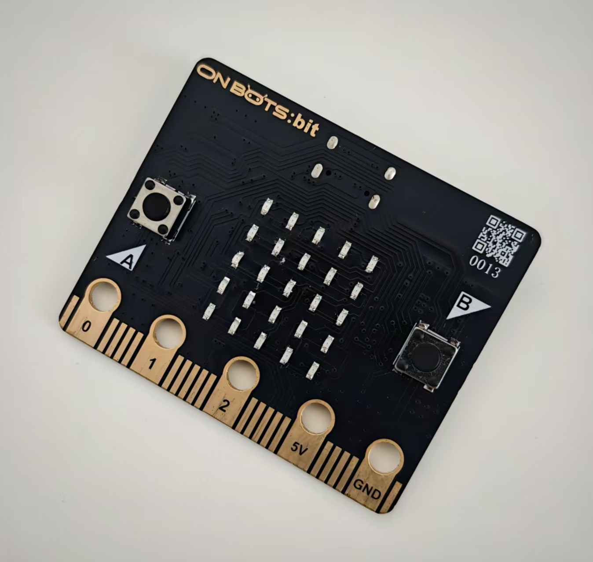

目录

声量计..............................................................................................102

• 超声波测距模块................................................................................104

• 示波器..............................................................................................106

3.反馈控制

• 气温控制...........................................................................................113

• 智能灯泡...........................................................................................114

• 距离感应...........................................................................................117

• 保持安全车距....................................................................................118

4.我的第一个 **ESP32** 机器人

• 平台组装...........................................................................................119

• 注意事项！.......................................................................................120

• 最简单的机器人................................................................................121

• 机器人指示灯....................................................................................122

• 音乐机器人.......................................................................................124

• 警车..................................................................................................125

• 安全出行...........................................................................................126

程序设计语言描述 .................................................................................128

趣味知识！

• 准确性是最重要的标准！..................................................................134

• 音符是声音频率................................................................................135

• 什么是RGB.......................................................................................136

