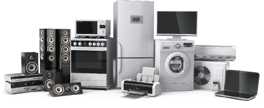
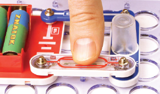
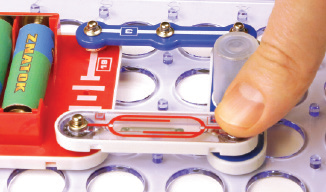

简介

几乎所有现代设备都将单片机作为其控制机制的一部分，它是设备与人之间或一台设备与另一台设备之间的连接。当然，机器人技术也少不了单片机。在本套产品中，你将学习 Arduino 的工作原理，它是广受欢迎的 ESP32 单片机系列中的一个模块。你学到的内容可能有朝一日会用于创造新型机器人、家用电器、电脑和智能手机等。

为了确保使用安全，延长使用寿命，请遵守以下规定：

• 注意正负极！某些元件标记了“+”号。如不注意正负极方向，电路可能无法工作甚至可能损坏电子元件！

• 在组装电路时，请勿用力向下按压元件中央。请在边缘的连接处用力。

• 请务必按说明书描述方式组装电路。

• 严禁将本套产品中的电路连接到家庭外接电路中。

• 多数电路问题都是组装不当引起的，请务必仔细检查你的电路，确保其完全符合说明书所述。检查并确保所有连接的安全性。

