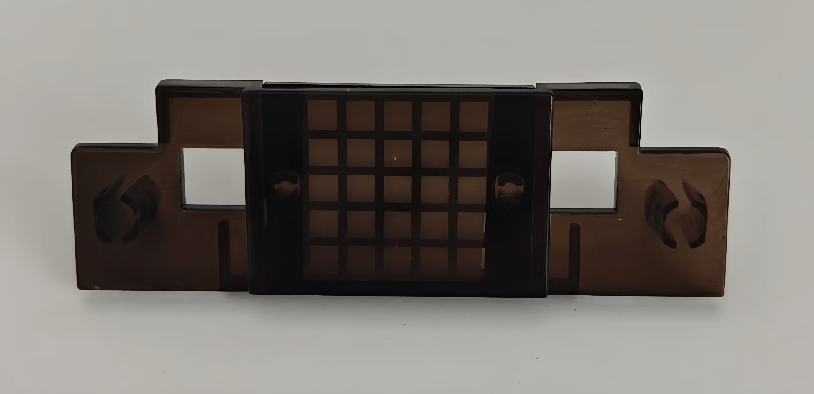

元件清单

代码 元件名称 数量 图示
107 三脚底座 1
111 ESP32 模块 1
112 蓝色发光二极管 1
113 黄色发光二极管 2
114 交通灯 1

代码 元件名称 数量 图示
115 RGB LED 1
116 电池盒（4节5号电池，电池未包含在内）1
117 USB适配器 1
118 可变电阻5K (5 kΩ) 1
119 电阻10 Ω (Ohm) 0.5 W 1
120 齿轮马达 2
121  LED 保护壳 1

