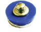
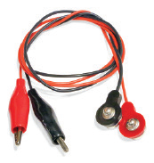
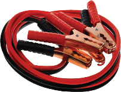

元件描述

导线

导线 连接各电路元件，对电路的属性没有影响。

本套产品使用三种不同类型的导线。

• 蓝色硬导线的标记显示了导线的长度及其接触点的数量。

导线1，是单个导线垫圈，可连接不同电路层之间的元器件。有时，它们也可作为电路的“桩”。

电路上不显示这类导线垫圈，因此，在使用导线垫圈的位置可作如下标示：

• 软导线，一端是与电路元件和硬导线相连的接触按键，另一端是连接到外部元件的“鳄鱼夹”。

• 两端都有接触按键的软导线，用于连接电路元件和硬导线。

导线的阻值越小越好，因此导线都是用金属制成的。不同金属阻值不同。银的阻值最低。如果从阻值来看，铜线是最佳选择，但铜不是性价比最高的金属。导线一般采用铝合金。尽管黄金的成本极高，但有时也会用来制作导线。因为黄金与其他金属不同，不会氧化，这一点非常关键，可用于太空和军事设备等。用黄金做导线，线非常纤细。

从下表可以看出，我们一般不用铁制造导线。导线越长，阻值越高。决定导线阻值的另一个更重要的因素是粗细：导线越纤细，阻值越大。因此，借助其他人的电池发动汽车使用的导线(如左图)都是非常粗短的铜线。

金属 电阻系数
银 0,015
铜 0,018
金 0,023
铝 0,029
钨 0,055
铁 0,098