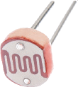

元件描述

开关

开关有两种位置：闭路 (ON)，电流通过开关；开路 (OFF)，电路断开，电流无法流动。开关不影响电路参数，但它可以通过断开或连接电路元件来改变其功能。

在电路中，开关的表示符号如下：

光敏电阻

它是一种半导体元件，阻值取决于亮度，因此又被称为光敏感电阻。当光线照射时，光敏电阻的阻值减小，同时电路中的电流增大，达到足以启动或运行相关设备的值。

应用

人体感应、灭火器、温度计（根据光的强度）、感应灯、安全警报器、光位计等。

在电路中，光敏电阻的表示符号如下：

在本套产品中，光敏电阻在黑暗中的阻值为 20 兆欧，在非常明亮光线中的阻值为 150 欧姆。