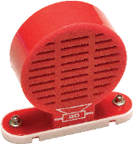
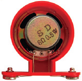
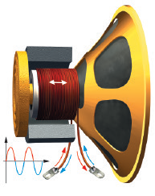
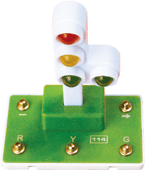

元件描述

喇叭

喇叭将电振荡转化为声音振动。喇叭用于耳机、电视、计算机、音响系统
喇叭、电话等。

喇叭也可称为扬声器。

在电路中，喇叭的表示符号如下：

金属外壳（喇叭纸盆框架）
喇叭纸盆
磁铁
音圈
磁芯
音圈外框
信号连接终端

交通灯

交通灯主体部分
“右转”附加部分
负极
方向“箭头”
红色信号灯
黄色信号灯
绿色信号灯

你可通过操作本产品模型的程序，了解到真正的道路交通灯使用原理。