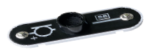
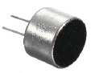
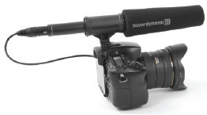
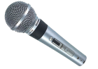

元件描述

麦克风

麦克风将音频信号转换为电信号。

声音是由空气振动产生的，空气振动越强烈，麦克风产生的电振荡就越强烈。但这种电振荡仍非常小，需要进一步增强。

主要特性： 灵敏度、频率范围、方向选择性、复合电阻。

应用： 智能手机、电脑、摄像机、录音室、电影和电视，以及任何你想录制、传输或放大声音的地方。例如，本套产品的第94模块就有内置麦克风。

麦克风的类型包括碳粒式、电动式（动圈式、铝带式）、电磁式、压电式（晶体式、陶瓷式）、电容式（直流极化式）或驻极体麦克风等。

本套产品使用驻极体麦克风。

在电路中，麦克风的表示符号如右上图：

原理

声音造成的空气振动压力作用在麦克风薄膜上。然后，根据麦克风的类型，将这些振动传递到电磁线圈、电容器板或压电元件上，将振动转化为电。根据转化类型和薄膜类型，麦克风的特性也有所区别。

声音

麦克风

电压

至放大器