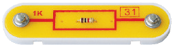
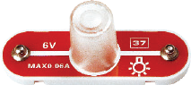
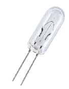

元件描述

电阻

电阻（来自拉丁语：Resisto）是一种干扰电流的元件，用于调节电流和电压。电阻产生的干扰越大，流过它的电流就越小。

阻值单位是欧姆，可附加表示倍数的前缀，如“千”、“兆”、“G兆”等（Ω、kΩ、 MΩ、GΩ...= “Q”、k、M、G...）。
1000 Ωs = 103 Ω = 1 kΩ,
1000 kΩ = 106 Ω = 103 kΩ = 1 MΩ
主要特性: 电阻额定值、准确度、功耗、温度系数、电路板上的安装方法。
应用：几乎用于所有电路。如果不是以独立元件的形式存在，则在集成电路内部。
在电路中，电阻的表示符号有两种：

灯泡

灯泡的工作原理如下：电流穿过钨丝时，钨丝升温并开始发光。钨丝在密封的玻璃灯泡内。

我们的灯泡设计为工作电压不超过6伏特和最大电流0.3安培。

尽管大量使用LED灯，白炽灯（灯泡）仍未停产，因为它具备其他灯具所缺乏的诸多优势。

在电路中，灯泡的表示符号如下：

在本套产品中，灯泡外面封装了半透明盖。
摘除外盖后，灯泡的外观如图：

请勿长时间盯着亮起的灯泡！