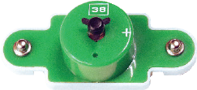
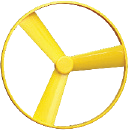
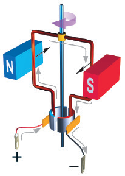
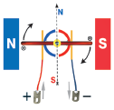
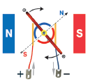
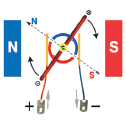
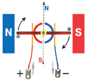

元件描述

电机

电机将电能转化为机械能。在本例中，电压是由旋转轴产生的。电压越高， 电机的转速就越快。但如果电压过高，可能导致发生故障。

电机可分为交流电和直流电两类。38电机是直流电电机。我们也可将它简称为马达。

在电路中，电机的表示符号如下：

电机轴顶上有一个用于装载风叶的电机帽。
!!!将风叶装到电机上时，切勿用力推压，只需轻轻地把风叶放到电机帽上。

原理

在永磁体的磁场中有一个框架，当电流沿框架流动时，框架应旋转 180 ° 并停止。要使框架继续旋转，必须改变框架中电流的方向。因此，必须使用集电极，即两个金属半圆环。想象框架已转动了180°（红色端集电极应位于左侧），你会发现电流已从原来的位置改变了方向。

轴

磁铁

方形线圈（框架）

分环整流子

电刷触电

电源终端

几乎任何形式的科技产品都会用到电机：机器人、汽车、飞机、家用电器、电脑，甚至智能手机等，智能手机的振动提醒使用了电机。

