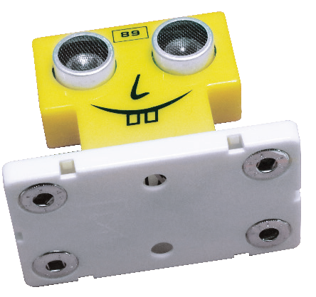
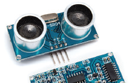
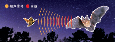
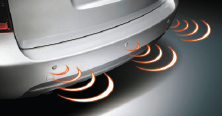

元件描述

超声波测距模块

无论测距模块的外观看起来如何酷炫，它的内部其实非常严谨。

![[Pasted image 20251021105721.png]]

超声测距模块的原理

超声测距模块的工作原理来自于蝙蝠和海豚，它们在完全黑暗的环境中也能准确定向，从不会撞上任何物体，还能轻易定位猎物。

发射器发送超声信号，物体将信号反射回来，接收器接收反射的信号。根据发送信号和反射信号（回波）之间的时间差即可计算距离。时间差越大，距离就越远。

回声探测器、声纳、雷达、自动机器人、车辆停放电子系统等就是应用了类似的原理。

