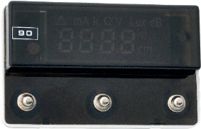
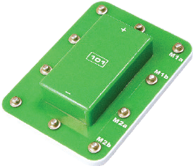

元件描述

数码显示器

90号通用电子显示屏可再现数值和测量单位，如：

• 电流 – mA

• 电阻 - Ω 和 k

• 电压 – V

• 亮度 – Lux

• 噪声分贝 – dB

• 温度 - °C

• 距离 – cm

此外，它还可以显示电路上收到的脉冲数（即作为计数器）或用在智能交通灯上，显示交通灯转换剩余的秒数。

溢出标志
控制输入M1a
控制输入M1b
控制输入M2a
电源负极
控制输入M2b
电源正极

电机驱动器

ESP32模块输出的最大电流不超过 20mA，不足以驱动电机和齿轮马达。为了增大功率，必须使用专门的驱动器。根据来自单片机的输入控制信号，连接到驱动器功率输出的电机可改变转动速度和方向。

输出M1通向第一齿轮马达，输出M2通向第二齿轮马达。

输出M1a
输出M1b
输出M2a
输出M2b
电源负极(-) 电源正极(+)
DIN数据
输入