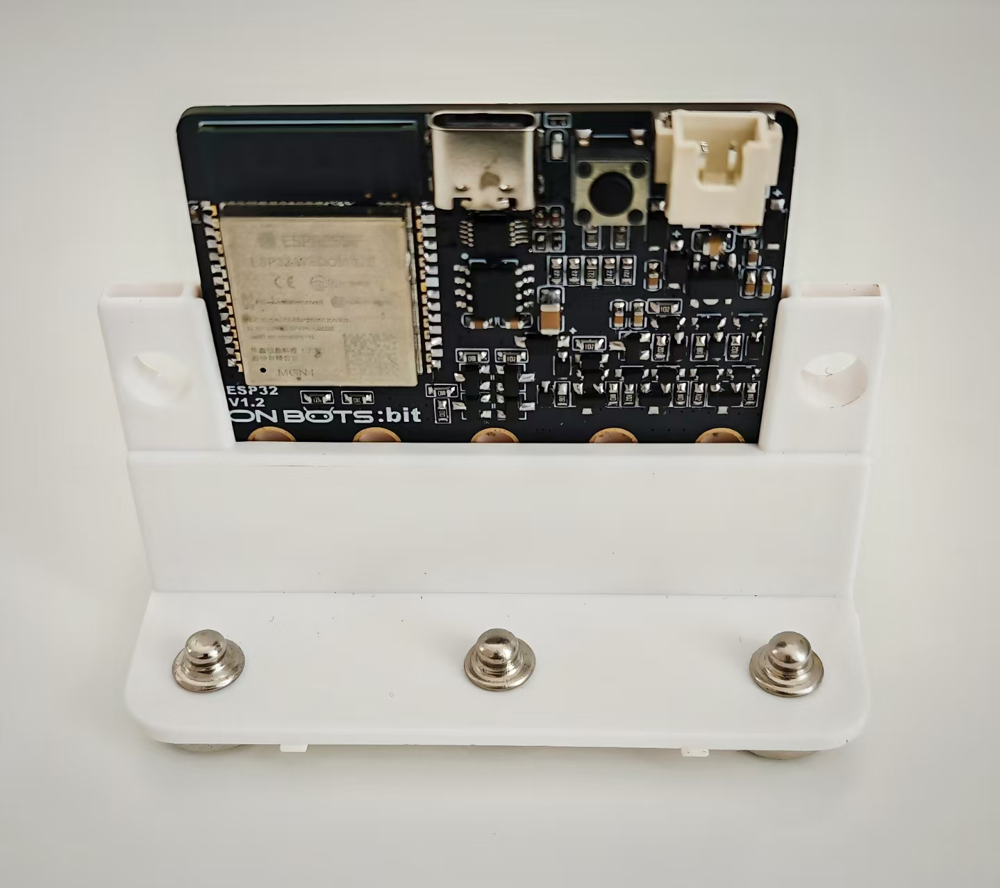
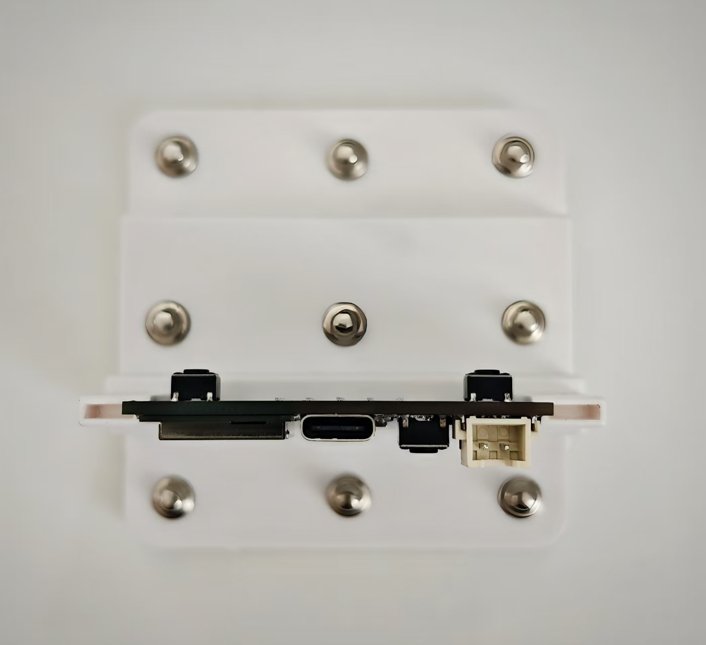
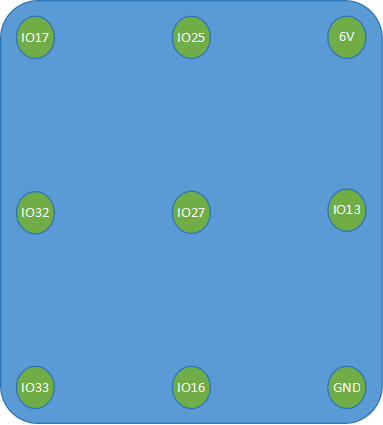

元件描述

ESP32 模块

111号模块基于 ESP32，它由 ESP32 系列单片机的 ESP32-WROOM-32E 模块和所需的其他元件组成。
单片机各不相同，功能类似于一台小型计算机。本套产品中的单片机可执行以下功能：
• 输出信息。根据程序设置，可控制LED、灯、电机等外部设备，播放声音，显示时间。
• 接收信息。根据程序设置，可处理来自外部设备的信息并在显示屏上重现。此模式可用于制作各种测量仪器。
• 接收信息，分析信息，并在分析的基础上提供信息。很多家用电器和机器人都会利用这些功能。

111号模块端口描述：
“6V” — 外部电源正极（经稳压后供给 3.3V 模块）
“GND” — 电源负极（地线）
IO16 — 数字输入/输出引脚
IO17 — 数字输入/输出引脚
IO25 — 数字输入/输出引脚，支持 ADC 输入与 DAC 输出  
IO27 — 数字输入/输出引脚，支持 ADC 输入与触摸检测  
IO32 — 数字输入/输出引脚，支持 ADC 输入与触摸检测  
IO33 — 数字输入/输出引脚，支持 ADC 输入与触摸检测 
IO13 — 数字输入/输出引脚，支持 ADC 输入与触摸检测