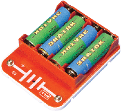
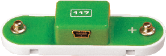
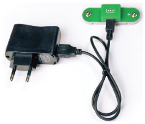

元件描述

电源

电池

USB适配器

电池为电路供电。本套产品使用四节电池，将其串联。最大电压为 6V(4x1.5V)，比家里电网中使用的电压要低得多。我们建议在本套产品中使用碱性电池（5号1.5V碱性电池）。

电池未包含在内。

为了节省电池， 你可通过 USB 适配器包括交直流适配器（输入：~220V / 50Hz，输出5V/1A)，和 USB-miniUSB 连接线及117号模块接入到家庭电网电路。

• 注意正负极！

• 请盖好电池盒盖。

• 再次检查117号模块的电池和终端是否存在短路！

• 如果任何电路元件发烫，立即断开电路电源，查明原因。

• 如果电池发烫，立即断开电源，查明原因。最有可能的原因是组装电路时出错。

本套产品使用两种电源：电池组和USB适配器。

在电路中，电池的表示符号
如下：

USB适配器组件外观如图所示。