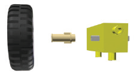
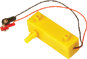
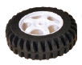
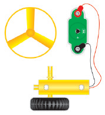
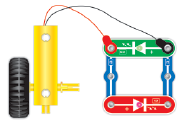
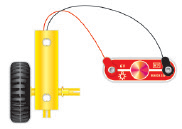

元件描述

齿轮马达

套装产品中的齿轮马达和轮子设计可能与图示不同。

齿轮马达由一台标准电机（电动马达）和一套齿轮减速器组成。减速器用于降低电机转速，提高电机转矩。

先将116号电池与38号电机连接，然后再接入120号齿轮马达，即可验证这一点。齿轮马达的转速会明显减慢，制动也会更为困难（请勿使它完全停止，因为这会导致电机过热！）

和传统电机一样，齿轮马达也可用作电流发生器。用特制的车轮卡扣把轮子固定在齿轮马达的轴上。组装其他电路，转动轮子，验证这一点。

通过这个电路，你可以清楚地了解减速器的工作原理。转动轮子，确保螺旋桨转得更快，因
为在这种情况下，减速器不会降低转速，反而会增加转速。改变轮子的转动方向。

你可转动38号电机轴，确保齿轮马达轴在转动时使用的转速要少得多。

这个电路清楚地说明了连接LED时注意正负极方向的重要性。先顺时针转动轮子，然后逆时针转动，根据整个齿轮马达输出电压的极性，LED会交替发光。

组装电路。改变轮子的转动方向。

这个电路可用于验证连接的极性对灯泡没有影响。并且， 电压和电流值取决于轮子的转动速度，转动速度越快，灯泡越亮。