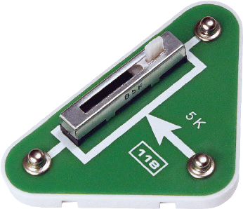

元件描述

可变电阻

可变电阻可用于调节电路中的电流或电压。它由A-B-C三个终端组成。A-B两点之间的阻值恒定（本例中为5kΩ）。当你移动滑块时，A-C和B-C两点之间的阻值会发生变化。当滑块位于A点时， A-C之间的阻值为0，B-C之间的阻值达到最大值，为5 k Ω。当滑块位于B点时，情况相反。

阻值单位是欧姆（参阅“电阻”部分）。

在电路中，电阻的表示符号有两种：

主要特性

电阻额定值、分辨率功率、功耗、温度系数、改变阻值的方法。

应用

可变电阻用于调节光强、声音音量、转速等。

可变电阻在电路中有两个重要作用：改变电阻（图a）和改变电位（图b）。图示将一盏灯作为负载。