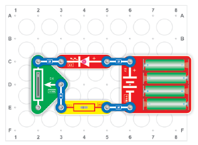
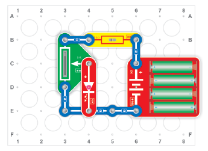
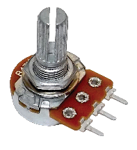
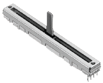
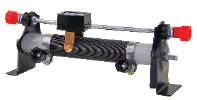
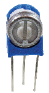

元件描述

改变电阻

组装电路。通过改变118号可变电阻的滑块位置，可调整LED光线强度。将滑块移到最下方，阻值最
强，LED光线非常暗。向上移动滑块，LED的光线亮度逐渐提高。你可将红色LED换为绿色LED、37号灯泡或38号电机，实时通过可变电阻改变它们的运行模式。

改变电位

可变电阻有滑块式（如本例所示），也有圆形滑杠式，有单圈式或多圈式，有预设式和可调节式，有绕线式和漆膜式...

每种在其应用领域中都是不可或缺的元件。

我们的LED有内置的保护电阻，所以你可将滑块移到最顶端(A)，如果LED未配备保护电阻，则不可如此操作。