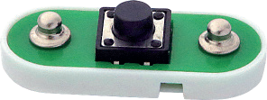
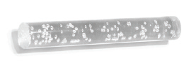
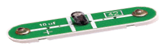

元件描述

按键

按键可能形状和大小不同，但被按下后都能通电，与门铃或电梯按键类似。
按键不会影响电网特性，但它们可以通过断开或连接电路元件来改变其功能。
在电路中，按键的表示符号如下：

光学效应

本套产品中包含一根透明灯柱和一束柔性光纤，通过特殊支架安装在115号模块上。115号模块顶部的小孔用于固定光纤。

安装支架

光纤树
透明灯柱

电容

电容可累积电荷。电容可分为陶瓷电容和电解电容。在本套产品中，42号是电解电容，在连接时，要注意它的极性。

在电路中，电容的表示符号如下：