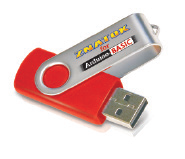
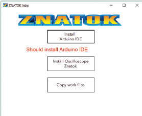
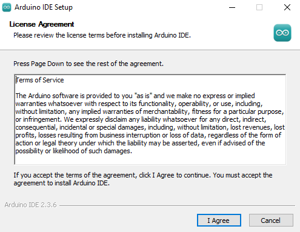

安装程序

安装程序

USB闪存驱动器。这通常是指一个简单的闪存驱动器。本套产品中的USB里存储了111号模块（**ESP32模块**）与计算机连接所需的驱动程序。其中一个文件夹是用于Windows系统的文件，另一个文件夹则是用于MacOS系统的文件。请按照以下说明进行操作。
Windows 用户

1. 将USB闪存驱动器插入计算机的一个USB端口。
2. 如未自动激活启动窗口，请通过Windows资源管理器或其他文件管理器（如TotalCommander）手动打开闪存文件夹（我的电脑-Znatok Arduino）。
3. 运行ZnatokIntro.exe程序。此程序将帮助您安装所有必要的组件。
4. 要安装Arduino IDE 编程环境，请点击 Install Arduino IDE（安装Arduino IDE）选项。如果您的计算机上已经安装了正确版本的Arduino IDE， 则可跳过本步骤。
   4.1. 按照安装说明：在出现的第一屏上，点击 I agree（我同意）。

