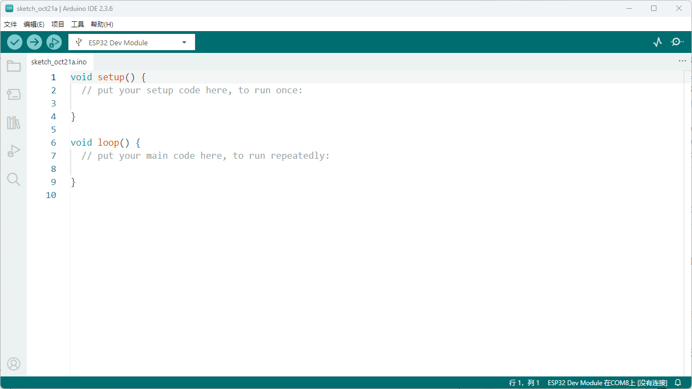

4.2 等待安装完成；完成后，单击“关闭”，桌面上将显示Arduino快捷方式。

5.若要安装Oscilloscope程序，请点击Install Znatok Oscilloscope（安装Znatok Oscilloscope）选项。如果之前已安装此程序，则可跳过本步骤。
5.1. 按照安装说明，单击下一步选项。
5.2. 程序安装成功后，Znatok Oscilloscope快捷方式将显示在桌面上。

6.为了成功开展实验室工作，你必须在电脑上创建一个工作文件夹，然后点击Copy working files（复制工作文件）选项，为此目的复制正确的文件。系统将提示你创建一个文件夹，默认位置是桌面。点击“选择”按键，屏幕上将出现Laboratory works Znatok Arduino文件夹，它将用于存储程序文件。

如要手动复制程序文件，可在闪存驱动器的LabatoryProjects文件夹

注意：我们不建议直接从USB闪存打开程序文件！

7.使用USB线将111号模块连接到电脑。安装将自动开始。如果禁用了自动搜索驱动程序，则可在闪存驱动器的“驱动程序”文件夹中手动找到这些文件，手动运行驱动安装程序 CH341SER.EXE 。

7.1.使用桌面上的快捷方式运行Arduino IDE。
界面描述：
1. 菜单。
2. 检查程序的按键。程序会查找语法（而不是逻辑）错误。
3. 将程序加载到ESP32模块的按键。
4. 主工作区包括所有程序代码。
5. 状态栏-显示加载进程的进度。
