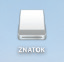

安装程序

对于macOS用户

1 将USB闪存驱动器插入电脑的USB接口，桌面上将显示闪存驱动器标签：

2 将压缩文件 arduino-ide_2.3.6_macOS_arm64.zip  ( Intel 系列处理器使用 arduino-ide_2.3.6_macOS_64bit.zip ) 复制到 Apple 系列处理器的 MacOS 电脑中 ( 如桌面上 )

![][033p2.png]

3 将压缩文件解压缩到适当位置（我们建议解压缩到“应用程序”），然后打开 arduino-ide_2.3.6_macOS_arm64.dmg 将应用程序拖拽到 Application 中

4 将Laboratory-Projects实验项目文件夹复制到任何合适位置。

5 在 USB 闪存驱动器的 drivers 目录中找到 CH341SER_MAC 目录中，打开安装文件：

6 按照安装说明进行操作：

