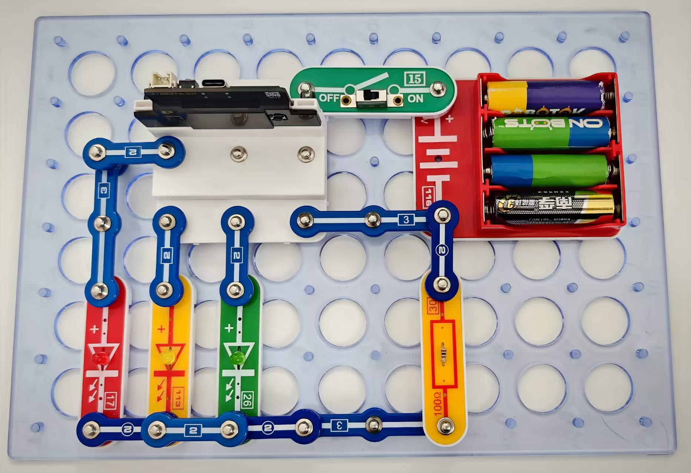

LED控制

按照图示组装电路。本电路包括3个程序。

01_Control_LED-7 –“交通灯”

01_Control_LED-8 –“闪光灯”

01_Control_LED-9 –“加速闪光灯”

使用USB线将111号模块连接到电脑。然后上传程序。上传程序后，断开连接，把15号电源开关拨到ON位置。

接下来，你可以看到带参数指示的程序。你可以通过改变它们的参数来改变电路的工作模式。您也可通过闪存驱动器访问这些程序。

