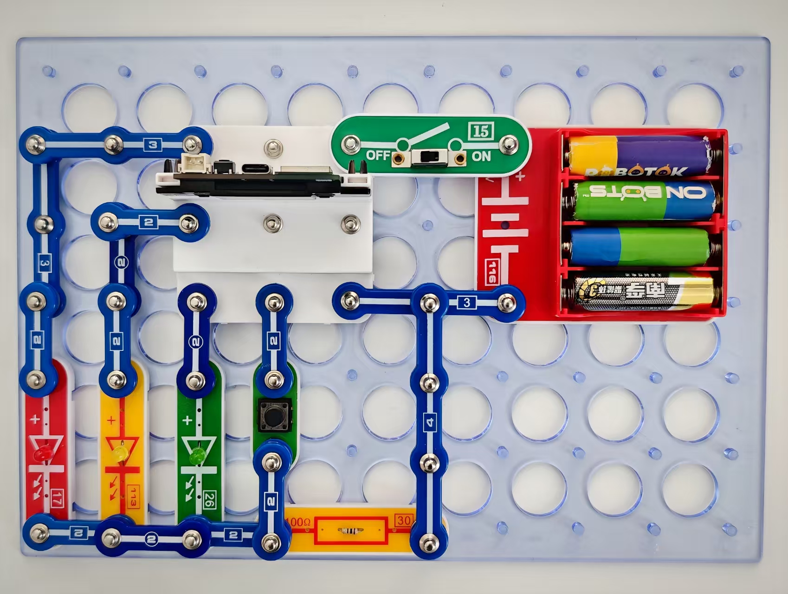

LED控制

按照图示组装电路。

本电路包括2个程序:

01_Control_LED-17 - “顺序选择”

01_Control_LED-18 - “随意选择”

这两个程序显示了按键的两种运行模式。第一种程序是按顺序搜索操作模式，每次按下按键就会激活下一项模式：

“跑马灯”-“徐徐开启”-“交通灯”。

但在这种方式下，选择特定某种模式可能不方便。

第二种程序可在按下按键时直接选择需要的模式。

短时按一次 -“跑马灯”

短时按两次 -“徐徐开启”

长时按一次（超过2秒）-“交通灯”

使用USB线将111号模块连接到电脑并上传程序。上传程序后，断开连接，把15号电源开关拨到ON位置。

您也可通过闪存驱动器访问这些程序。

