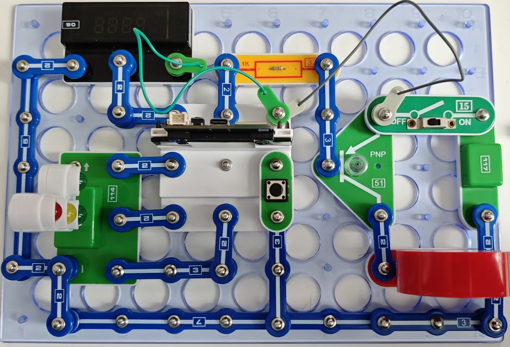

智能交通灯

如果交通灯上显示距离下一次变化剩余的秒数，显然会更加方便。
按照图示组装电路。本电路包括2个程序。

02_Traffic_Light-3 - “自动控制”

02_Traffic_Light-4 - “人工控制”

本电路使用由交直流适配器供电的117号模块，但也可使用116号电池盒。使用USB线将111号模块连接到电脑并上传程序。上传程序后，断开111号模块的导线，将网络适配器连接到117号模块并将15号电源开关拨到ON的位置。

(图中是5.1k电阻)
