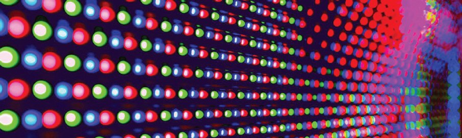

颜色混合

03_RGB_Mix-3

上传后，RGB-LED程序将随机变化颜色。下面是调整切换速度的方法。

切换延迟
将此值从250变为5000，每隔5秒变化颜色。思考如何制作各种颜色！

```c
  int switchDelay = 250;
  
  setRGB(random(256), random(256), random(256));
  delay(switchDelay);
```

每次在程序修改后，请将文件重命名并保存到你的项目文件夹中。别忘记将更新后的程序上传到111号模块(ESP32)！

