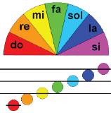

光与音乐

04_Color_Music-1

上传程序后，115号LED模块开始依次生成彩虹的七种颜色，喇叭播放七个不同的音符。然后重
复以上周期。

下面是程序的一个片段，它展示了如何改变切换速度及播放的音符高低。你也可通过闪存驱动器
访问本程序。

04_Color_Music-2

在本程序中，每次将RGB LED切换到一种随机颜色时，将产生随机的声音频率。下面是程序的一个片段，它展示了如何改变切换速度及喇叭的最小及最大
频率。你也可通过闪存驱动器访问本程序。

切换延迟
将此值降至500，观察音符和颜色切换速度是否加快

音高
将0变为1，观察音符是否提高一个八度。请注意，本程序假定只使用两个八度音阶，因此如果将此参数更改为其他值，程序将无法正确运行。

```c
  int switchDelay = 1000;
  int octaveNumber = 0;
```

切换延迟
将此值从300变为500，观察音符和颜色切换速度是否加快。

最小频率
将此参数从400变为150，观察产生的音符中是否有非常低的音符。

最大频率
将此参数从1000变为5000，观察产生的音符中是否有非常高的音符。

```c
int switchDelay = 300;
int minFrequency = 400;
int maxFrequency = 1000;
```

趣味知识！
许多著名的作曲家，例如S c r i a b i n 、R i m s k y -Korsakov、Ciurlionis、Messiaen等都曾尝试将音符与特定的颜色联系起来。他们都取得不同的成果。我们的做法比较简单，我们仅用七个音符(Do-Re-Mi-Fa-So-La-Ti)，将它们与彩虹的七种颜色联系起来（红-橙-黄-绿-蓝-靛-紫）。你可以创作自己的组合。

