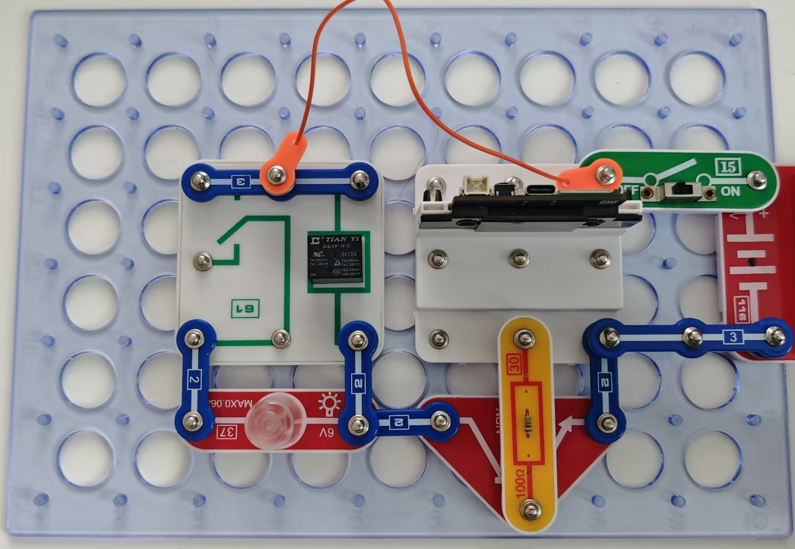

灯泡控制

本电路显示如何通过电池继电器控制灯泡。

按照图示组装电路。本电路包括1个程序：06_Lamp_Control-3 -“继电器控制”。

使用USB线将111号模块连接到电脑并上传程序。上传程序后，断开连接，把15号电源开关拨到
ON位置。灯泡会开始打开和关闭。

在本电路中，52号三极管用于放大61号继电器线圈所需的电流。
在本项目中，就像之前的电路一样，无法逐步改变灯泡的强度，但之后的项目可进行此项操作。

