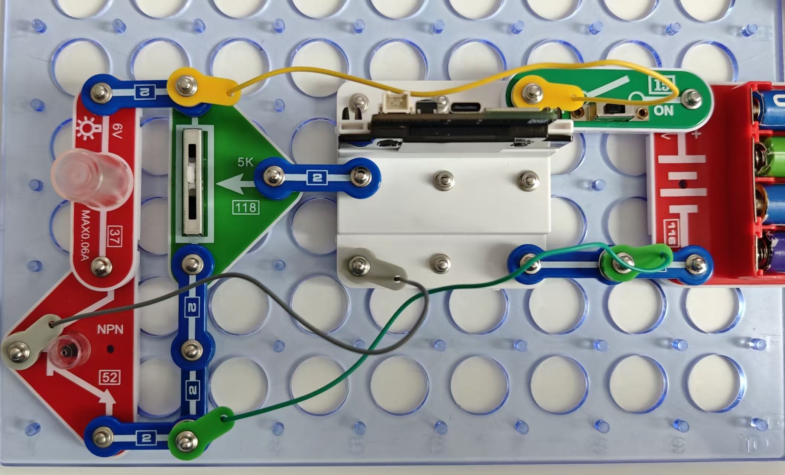

灯泡控制

按照图示组装电路。本电路包括3个程序：

06_Lamp_Control-5 - “线性相关”。
当滑块向上移动时，灯泡强度变亮。但我们不需要单片机即可实现这一项！下面的程序显示了如何
改变同一个电路的运行模式。

06_Lamp_Control-6 - “非线性相关”。
当移动滑块时，灯泡光强度会您也可通过闪存驱动器访问这些程序。先增加后减小。可变电阻都不具备此项特性！

06_Lamp_Control-7 - “超负荷”。
当滑块向上移动时，灯泡强度会增加，但如果超过设定的水平，它将进入闪烁模式，即发出危险信号！

使用USB线将111号模块连接到电脑。然后上传程序。上传程序后，断开连接，把15号电源开关拨
到ON位置。

