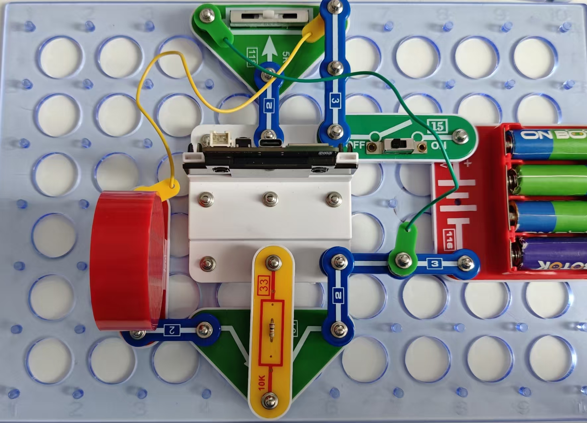

声音合成器

按照图示组装电路。本电路包括2个程序：

07_Synth-3 - “手动声音”。
程序描述见下。

07_Synth-4 - “三首旋律”。
本程序可通过可变电阻选择三首可重复的旋律之一，通过将滑块置于最左、中央和最右三个位置进行选择。

使用USB线将111号模块连接到电脑并上传程序。上传程序后，断开连接，把15号电源开关拨到ON位置。移动电阻滑块，试试播放旋律。

07_Synth-3

本程序使用可变电阻来控制喇叭的声音频率。下面是程序的一个片段，它展示了如何实现再现声音的最小和最大频率。

你也可通过闪存驱动器访问整个程序。

最小频率
将此参数更改为100，聆听在变阻器一端的声音是否更低 - 从400Hz变为100Hz

打开次数
将此参数更改为6000，聆听在将变阻器从最左端滑动到最右端时，声音是否变高 - 从3kHz变为6 kHz

```c
#define MIN_FREQUENCY 400
#define MAX_FREQUENCY 3000
```

