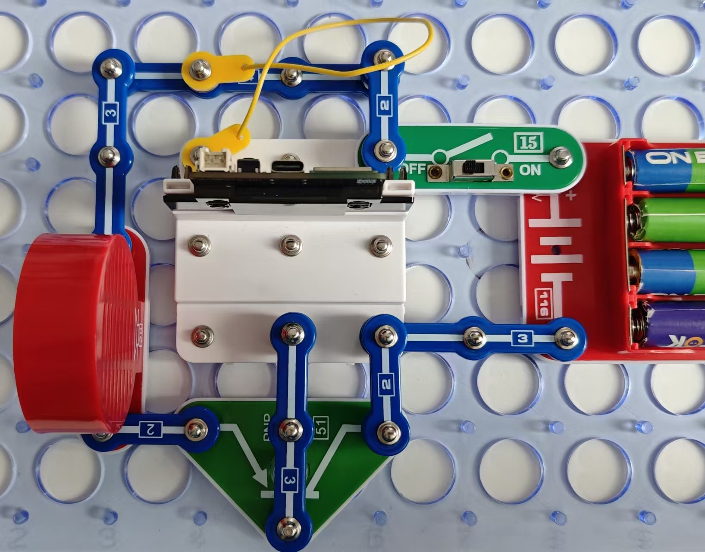

警报

对于电路中断是最简单、最常见的安保系统。在本例中，我们只需要重置橙色导线的一个终端。按照图示组装电路。本电路包括2个程序：

08_Signaling-2A - “警报”。如电路中断，警报将被激活。

08_Signaling-2B - “狗叫”。如电路中断，狗叫声将被激活。

使用USB线将111号模块连接到电脑并上传程序。上传程序后，断开连接，把15号电源开关拨到ON位置。断开橙色导线。

你也可通过闪存驱动器访问本程序。

在汽车警报器中，当有人非法打开车门或引擎盖时，电触点断开，触发警报。一般而言，警报使用的不是导线，而是簧片开关或磁铁，在触点断开时中断电路。上述电路通常用于门窗安保。

