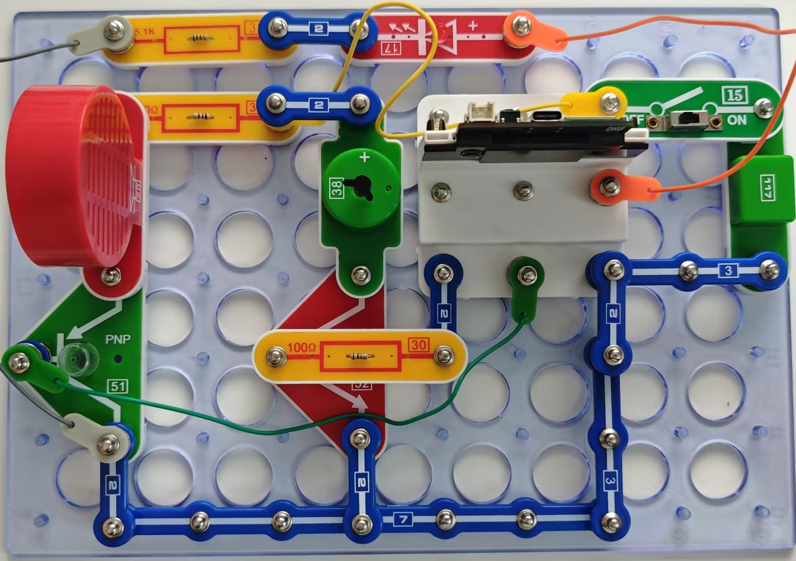
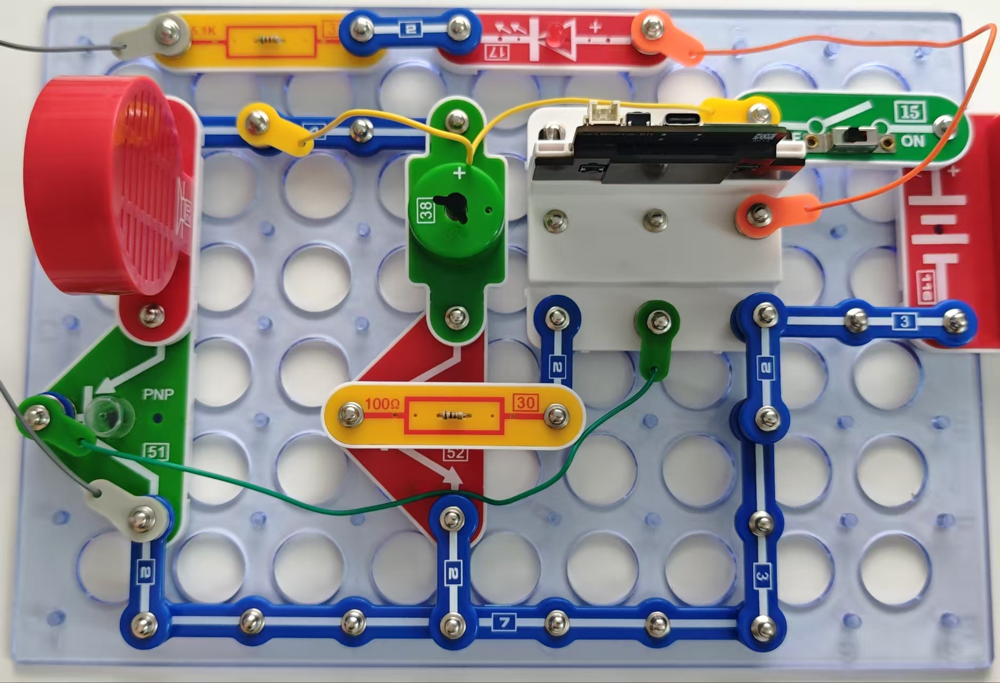
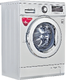

混合串联

对于高级用户

使用前一个示例绘制此程序的示意图。

按照图示组装电路。举个例子，你可以把螺旋桨风叶附在电机上。注意正负极！

本电路包括1个程序：

09_Mix-2 - “洗衣机”。

本程序执行洗衣机的算法：它发出启动和完成声音信号，在“清洗”模式启动电机，然后激活“转动”模式。“洗衣机”的整个周期为20秒。你可自己改变电路的参数，你现在应该知道如何操作了。

使用USB线将111号模块连接到电脑并上传程序。上传程序后，断开连接，把15号电源开关拨到ON位置。

你也可通过闪存驱动器访问本程序。

洗衣机中的单片机具备完全相同的功能：它控制电机的转速和旋转方向，设定运行时间，提供声音和光信号。

(若使用原版 5V 稳压电源模块，则需要加个100Ω限流电阻，以同时带动电机和喇叭)

(PS: 若使用电池盒，则无需额外的限流电阻)

