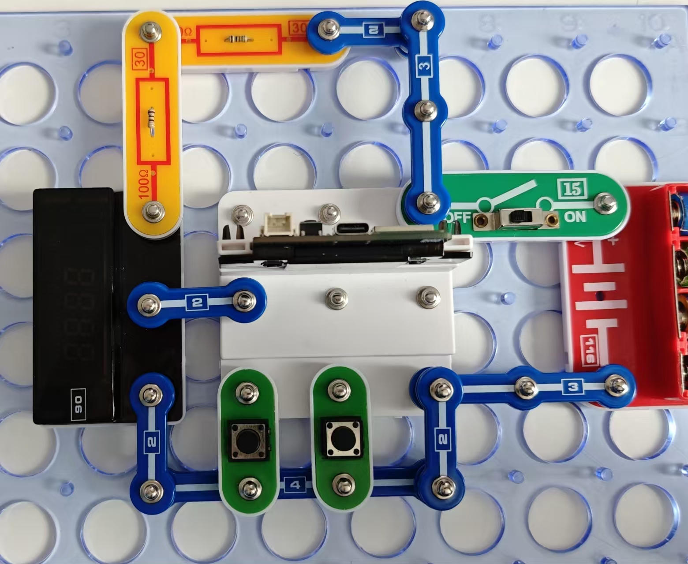

计数器、秒表、时钟

手表和智能手机可在多种模式下运行。我们将分析每一种模式。

按照图示组装电路。本电路包括3个程序：

10_Clock-1 - “数字计数器”。

10_Clock-2 - “秒表”。

10_Clock-3 - “时钟”。

使用USB线将111号模块连接到电脑。然后上传程序。上传程序后，断开连接，把15号电源开关拨到ON位置。

现代设备往往这三种功能合并在一起，但为了理解程序的差别，我们将分别研究它们。

