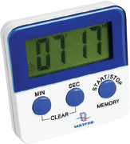

计时器

有些计时器单独存在，有些则整合到数字时钟和智能手机等更复杂的设备中。

按照图示组装电路。本电路包括1个程序：

11_Timer-1 - “计时器”。

使用USB线将111号模块连接到电脑并上传程序。上传程序后，断开连接，把15号电源开关拨到ON
位置。

11_ Timer-1

本程序可设置时间并在显示器上启动倒计时。若要设置计时器，请按下并按住按键（至少2秒）-电路将进入设置分钟的模式：显示器上对应部分开始闪烁。短按键，即可调校正确的分钟数值。最大值为59分钟。然后，长时间按住按键（至少2秒），可启动类似模式并设置秒数。最大值为59秒。再次长时间按键，即可进入倒数准备模式。短暂按下按键即可启动计时器，再次短暂按下按键可将计时器重置为零。

