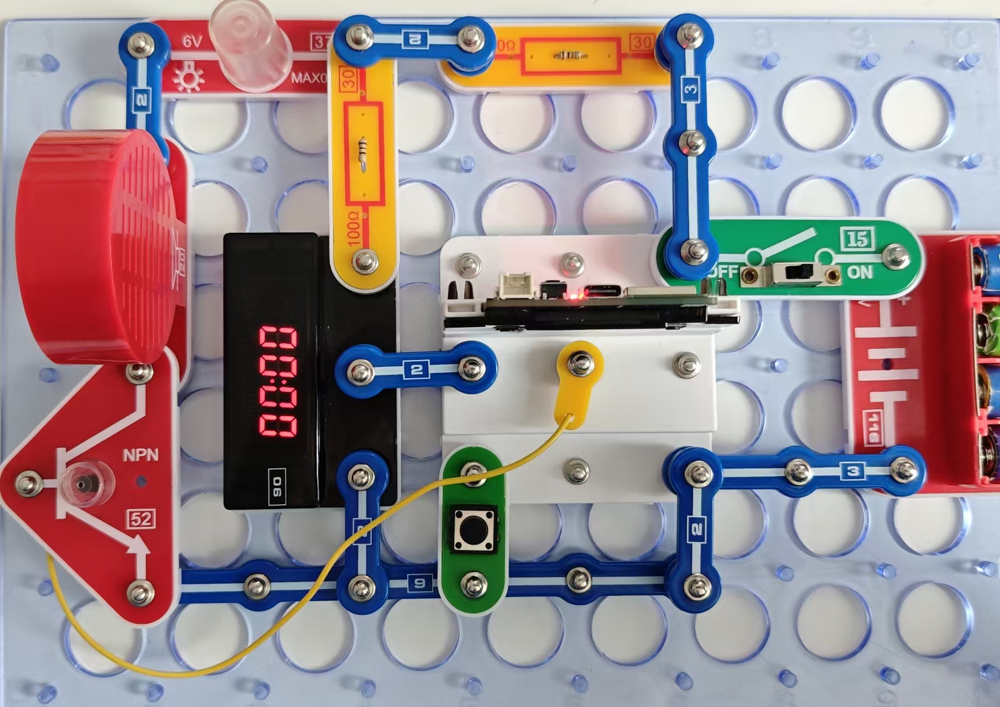
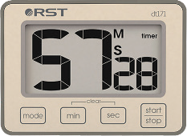

计时器

11_ Timer-2

按照图示组装电路。本电路包括1个程序：
11_Timer-2 - “声光显示计时器”。

使用USB线将111号模块连接到电脑并上传程序。上传程序后，断开连接，把15号电源开关拨到ON位置。

本程序运行原理与程序11-Time-1类似, 区别仅仅在于倒计时结束时会发出声光信号。你可以用3号导线代替 20号喇叭或37号灯泡，或保留光信号，或保留声信号。在某些场景里有时需要这些功能。

与之前的电路一样，计时器上可设置的最大时间为59分59秒。

您也可通过闪存驱动器访问这些程序。

