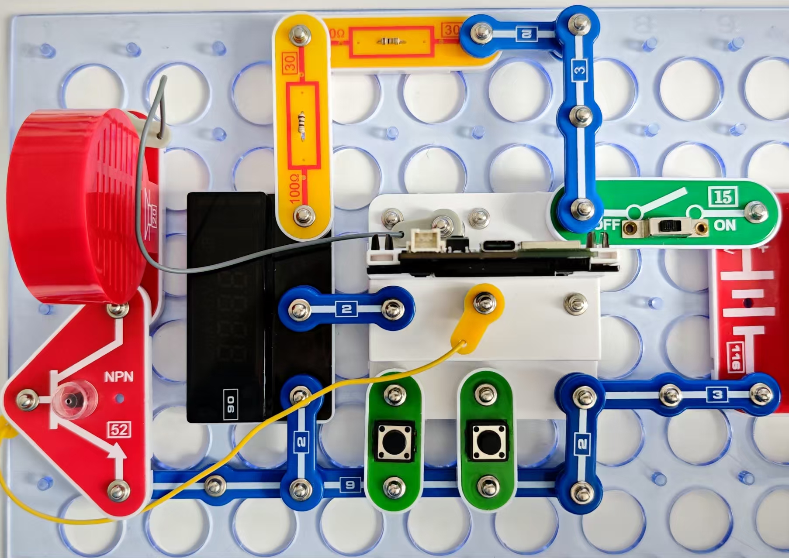
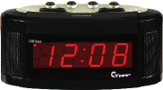

闹钟和节拍器

按照图示组装电路。本电路包括2个程序：
12_Alarm-1 - “闹钟”。
闹钟也许是最有用、同时也最令人讨厌的设备之一。
12_Alarm-2 - “节拍器”。
音乐初学者的必备品。

使用USB线将111号模块连接到电脑，然后上传程序。上传程序后，断开连接，把15号电源开关拨到ON位置。

12_ Alarm-1

在上传程序并打开电源后，电路将成为一个带闹钟的时钟，显示器显示当前时间，当达到设定值时，喇叭将发出声音信号。

设置当前时间（左按键）。

• 按住左按键（至少2秒）-电路将进入设置小时的模式：90号显示器上相应的部分将闪烁。
• 短暂按下同一按键，设置当前小时时间。
• 按住左按键（至少2秒）-电路将进入设置分钟的模式：90号显示器上相应的部分将闪烁。
• 短暂按下同一按键，设置正确数值。
• 按住左按键（至少2秒）-电路将进入当前时间模式。

