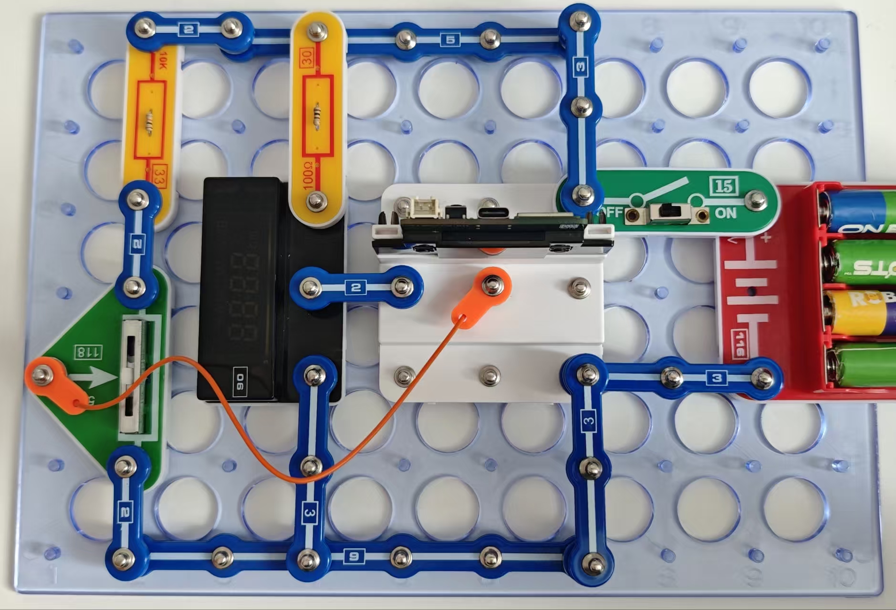

数字电压表

电压表用于测量电压。由于电压不同，电压表也不一样。我们的电压表用来测量直流电压，所以当连接输入电压时，必须注意极性。

按照图示组装电路。本电路包括1个程序：
14_Volt-1 - “直流电压表”。

使用USB线将111号模块连接到电脑并上传程序。上传程序后，断开连接，把15号电源开关拨到ON
位置。我们电压表的测量范围是0到5伏，所以当可变电阻的滑块处于最左边的位置时，当施加(6v)输入电压时，显示器将显示5v和“溢出”标志。

