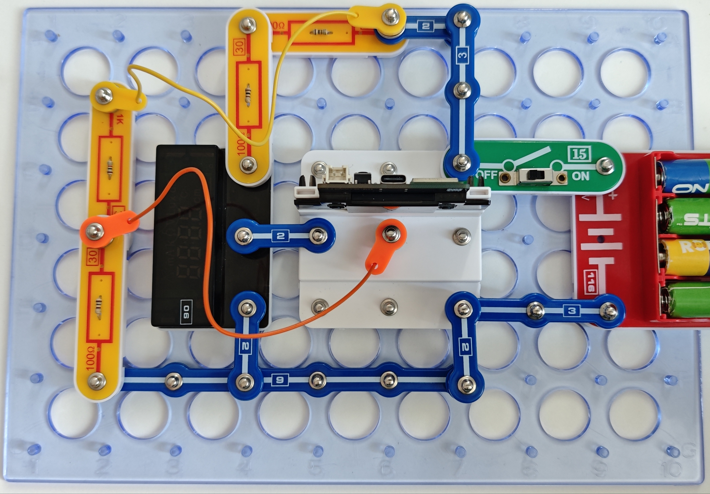

欧姆表

地球上的任何物质都会对电流产生电阻。主要分为三种基本类型：

导体是指极易导电的材料。例如铜、银、铝等。

半导体是指在一定条件下（ 辐射、温度变化等）传导电流的材料。

例如，硅、锗、硒等。

绝缘体是不导电的材料。例如，空气、玻璃、塑料等。

组装电路。不同的测量范围需要不同的电阻和程序：

0-1kΩ - 31号电阻(1kΩ) -程序16_Ohm-1

1kΩ -10kΩ - 33号电阻(10kQ) -程序16_Ohm-2

10kΩ -100kΩ - 34号电阻(100kΩ)-程序16_Ohm-3

严禁将本欧姆表接入家用220V电网！

如果知道电流和电压的值，那么根据公式R=U/I，很容易计算电阻值。

您也可通过闪存驱动器访问这些程序。

使用USB线将111号模块连接到电脑并上传程序。上传程序后，断开连接，把15号电源开关拨到ON位置。

首先，我们建议你本套电阻的阻值。

测量周围物体的阻值，如金属勺、玻璃杯、木椅等。试试测量淡水、盐水、人体的阻值。

