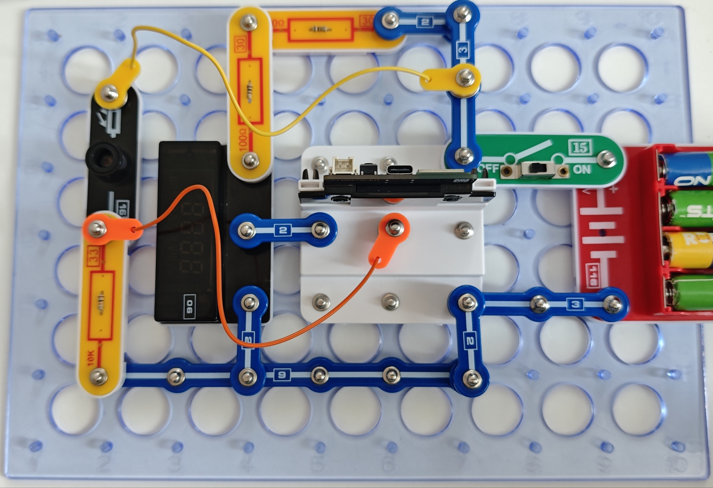
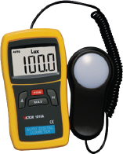

照度计

照度使用勒克斯Lux来计量，所以用于测量照度的照度计也被称为勒克斯计。

按照图示组装电路。本电路包括2个程序：
17_LUX-1 - “照度计”。设备开关一打开，就会开始测量照到光敏电阻的强度。光线越强，设备读数越高。
17_LUX-2 - “光学计数器”。将手放在光敏电阻上数次，遮挡光线。每次遮挡时，读数将增加。

使用USB线将111号模块连接到电脑。然后上传程序。上传程序后，断开连接，把15号电源开关拨到ON位置。我们将16号光敏电阻作为光传感器。

使用组装好的设备，确定找出房间里最亮和最暗的位置。

测量范围为1000 lux。
如果超出范围，显示器将显示“溢出”提示。

您也可通过闪存驱动器访问这些程序。

