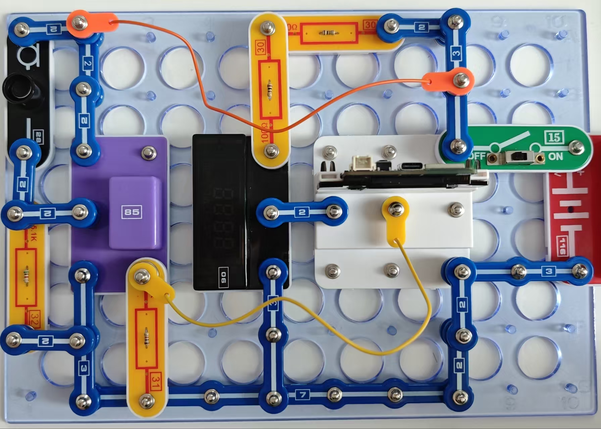
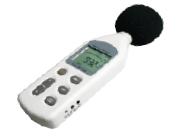

声量计

您也可通过闪存驱动器访问这些程序。

按照图示组装电路。本电路包括1个程序：

19_Noise 2 - “带有光显示信号的声量计”。

使用USB线将111号模块连接到电脑并上传程序。上传程序后，断开连接，把15号电源开关拨到ON位置。设备不仅将显示声级(dB)，还将在104号LED模块上显示音量水平，音量越高，亮起的LED数量越多。

如果107号模块绘图如左，请绘制出该拼法的电路原理图。

你可以测量家里在白天和夜晚的背景声音，测量电视或音乐的音量，自来水的声音，或者你自己说话的音量。

读数取决于你说话的音量大小以及你与麦克风的距离。

