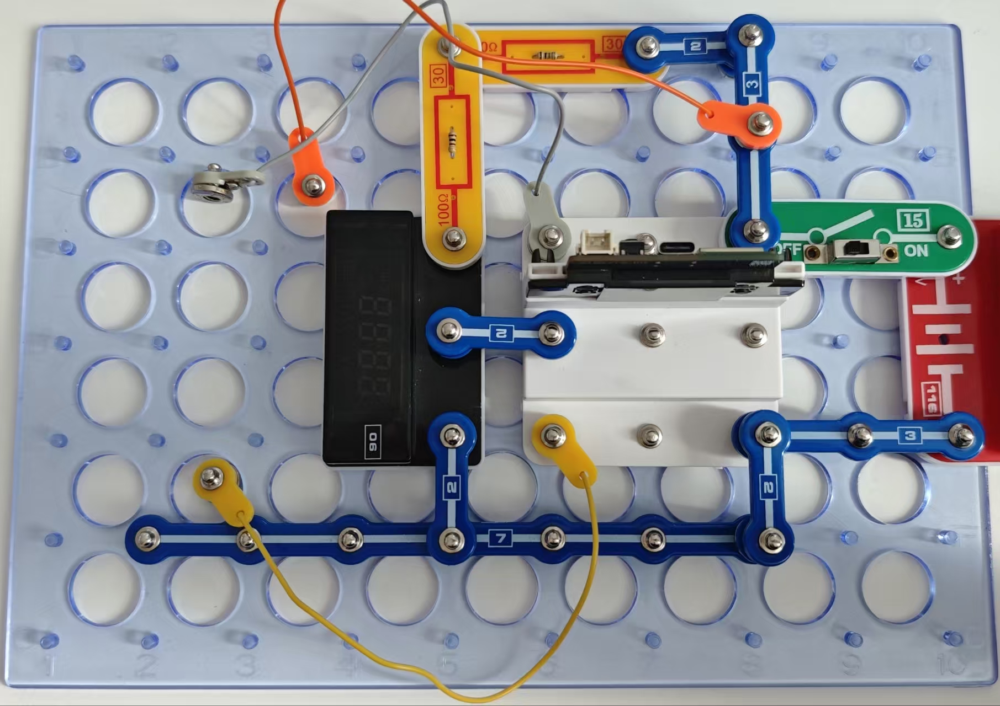

超声波测距仪

按照图示组装电路。本电路包括1个程序：
20_Ultrasonic - “超声测距模块”。
您也可通过闪存驱动器访问此程序。

使用USB线将111号模块连接到电脑并上传程序。上传程序后，断开连接，把15号电源开关拨到ON位置。仪器将显示89号传感器与物体的距离，以厘米为单位。

将测距模块的89号超声发射器指向最近的墙壁，测距模块将显示与墙壁的距离。你可用软尺或直尺检查测量的准确性。改变墙与测距模块之间的距离，观察仪器读数的变化。如果你想测量短距离，你可以用自己的手或本手册对准仪器。

