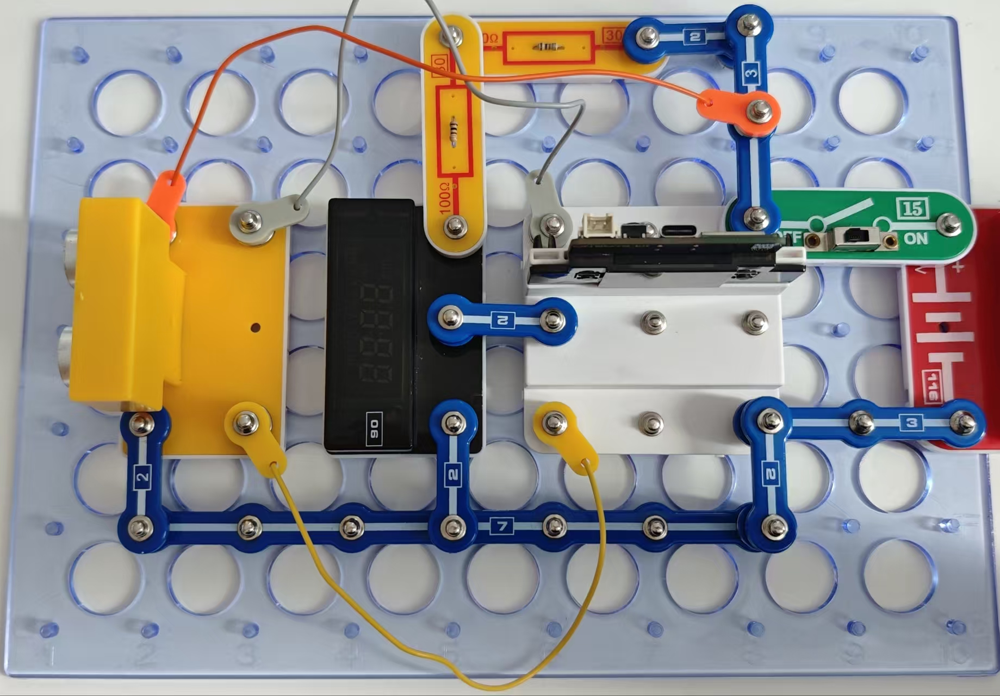
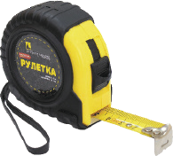

超声波测距仪

左图说明了89号超声传感器下导线的位置。

对于高级用户
用卷尺测量并验证测距仪的准确性，确定读数的类型或误差：加性、乘性或线性误差。测量5、25、50、75、100和150厘米。画出一个图表。请注意，测量距离时应以接收器和发射器为端点，而不应以模块的89号外壳为端点。

测量范围为3~300 cm。
300厘米=3米。

89号模块的接收器和发射器必须与物体的距离相同。

物体的表面积应不为0.5平方米（距离大于50厘米）。

如果表面不均匀或与与测距模块成一个角度，读数可能不准确。

如要测量天花板的高度，你需要考虑测距仪本身的尺寸。

