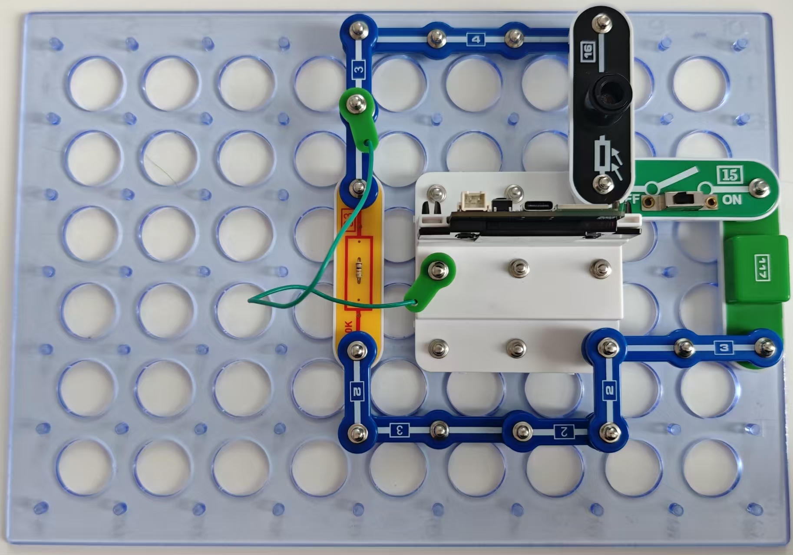

示波器（结束）

本电路可观察并记录光线变化。这类电路可用于分析一天中照射植物的光量。

按照图示组装电路。本电路包括1个程序：21_Osc-1。

使用USB线将111号模块连接到电脑并上传程序。上传程序后，断开导线，连接电源到117号交直流适配器模块并将15号电源开关拨到ON的位置。在电脑上运行示波器程序。遮挡照射16号光敏电阻的光线，然后观察屏幕。

你可以使用116号电池盒代替117号模块和电源适配器，但不适合较长时间的观察。

