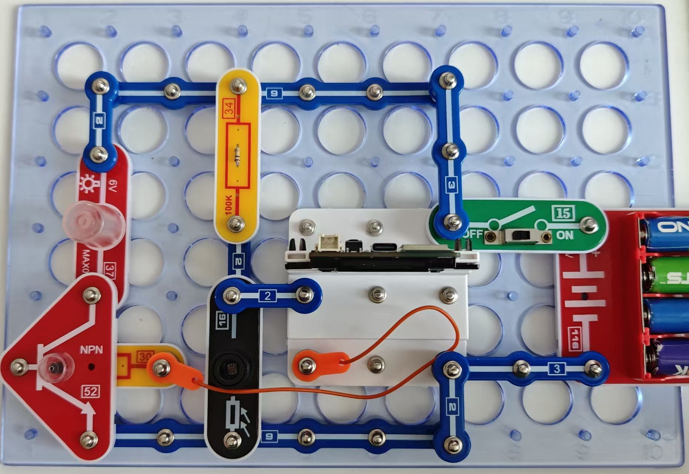

智能路灯

令人遗憾的是，即使在阳光明媚的日子里，路灯仍一直亮着，浪费大量电力。其实，解决办法非常简单。

按照图示组装电路。本电路包括1个程序：
23_Smart Light-1 - “运行NPN”。

使用USB线将111号模块连接到电脑并上传程序。上传程序后，断开连接，把15号电源开关拨到ON位置。如光线照射16号光敏电阻，则灯泡熄灭。照射光敏电阻的光线越弱，灯泡越亮。用一根手指遮挡光敏电阻或关闭光源，然后观察。

23_ Smart Light-1

本程序可用于设置光照度，在此基础上，电路将逐渐增加灯泡发光的亮度。下面是程序的一个片段，它显示了如何改变激活灯泡的阈值以及峰值强度的参数。

峰值设置
将此参数改为100，观察灯泡是否在完全黑暗的环境下也无法达到峰值亮度。

阈值
将此参数降为400，观察灯泡激活的速率是否加快。

```c
  int minBrightness = 0;
  int maxBrightness = 255;
  int threshold = 800;
```

