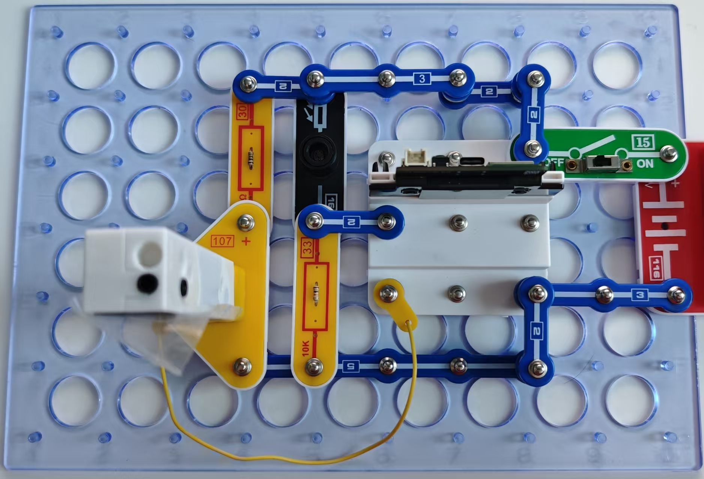

智能路灯（结束）

LED灯越来越普遍，我们将学到更多关于使用此类灯具的知识。

按照图示组装电路。将104号模块插入107号底座。本电路包括2个程序：

23_Smart Light-3 - “控制数量”。随着光线减弱，LED开启的数量会增加。

23_Smart Light-4 - “控制亮度”。随着光线减弱，所有LED的亮度会提高。

使用USB线将111号模块连接到电脑。然后上传某一程序。上传程序后，断开连接，把15号电源开关拨到ON位置。运行原理相同，即电路根据照射光敏电阻的光量作出反应。但是，两个程序完全不同！

