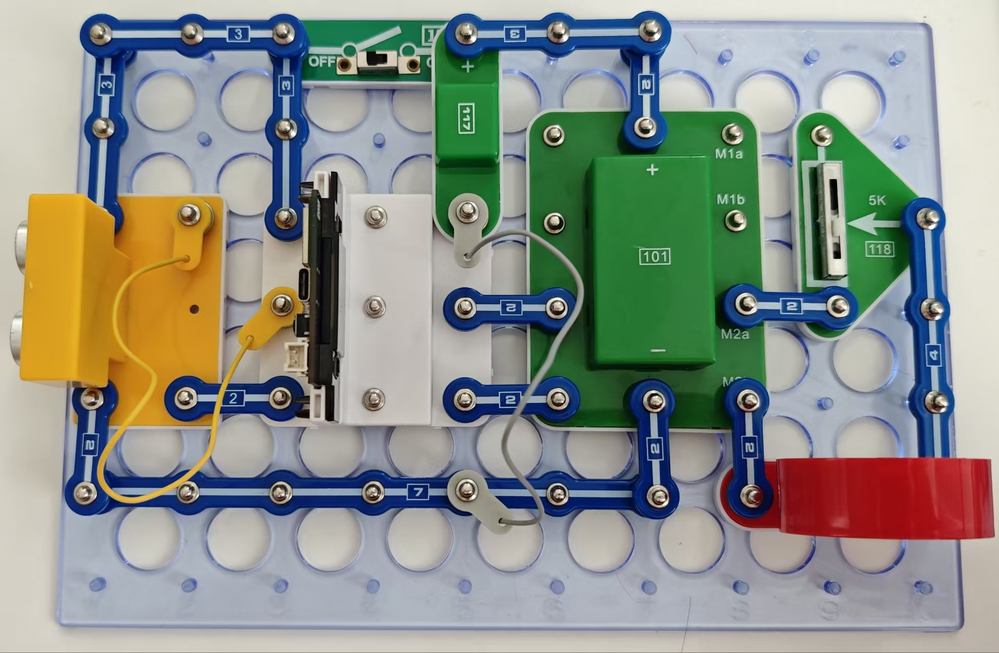

乐器“距离感应声乐”

人会演奏各种乐器！我们带来了又一种新的乐器，称为“距离感应声乐”，因为它产生的音符对应它与89号超声传感器的距离。你可用手操作，但最好使用水平表面（如硬封面手册）进行操作。

按照图示组装电路。本电路包括2个程序：
24_Music-1 - “一个八度”。
24_Music-2 - “两个八度”。

使用USB线将111号模块连接到电脑，然后上传程序24_Music-1。下载程序后，断开导线，连接网络中包含的117号交直流适配器模块并将15号电源开关拨到ON的位置。设置89号超声传感器，在3至27厘米范围内，按3厘米一个间隔，排定第一个八度的所有音符及第二个八度的Do音。也就是说，你可通过改变手与传感器的距离弹奏各种旋律。如果手移动的距离超过3厘米或不到3厘米，则传感器保持安静。

如果上传程序24_Music-2，则范围扩大，音符也变多，包含高音和第二个八度的音符。运行范围：3至51厘米，按每个间隔2厘米逐渐增加。

可以通过可变电阻调整音量。

对于高级用户
为电路添加一个按键并改变程序，使它仅在按下按键时弹奏音符，而不是持续弹奏，以便轻松弹奏出一段旋律！

