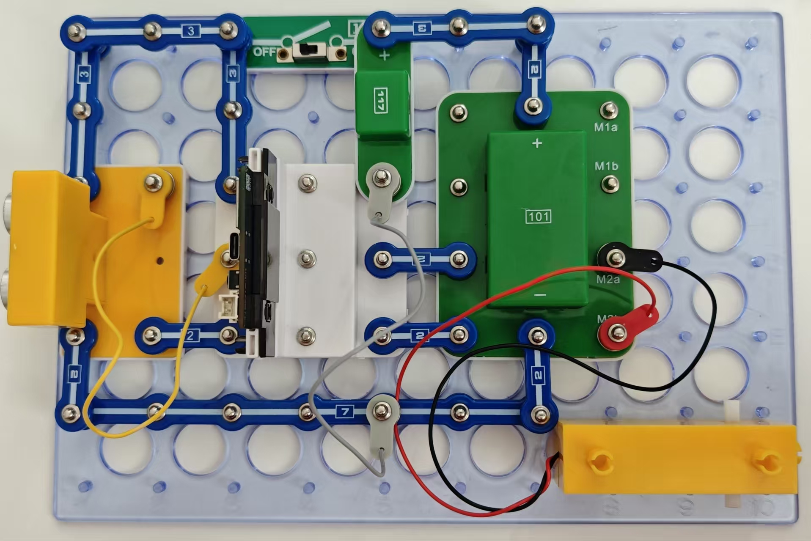
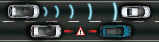

保持安全车距

本项目是为了与前方车辆保持安全距离或及时刹车以避免撞车。

按照图示组装电路。本电路包括1个程序：
25_Distance - “保持安全车距”。

使用USB线将111号模块连接到电脑并上传程序。上传程序后，断开导线，将电源适配器连接到117号模块，抬起齿轮马达，确保轮子未接触任何物体。打开电源。

89号超声传感器设为保持30厘米的距离。如传感器与障碍物之间的距离小于30厘米，则齿轮马达将逆时针转动，模拟后退。如距离大于30厘米，则齿轮马达将顺时针转动，模拟前进。如距离为30 ± 1厘米，齿轮马达停止。

对于高级用户

你可找到设定电机停止所对应距离的程序行，以及电机开始反向转动所对应距离的程序行，改变其数值参数。根据新设定值，检查电路能否正确运行。

