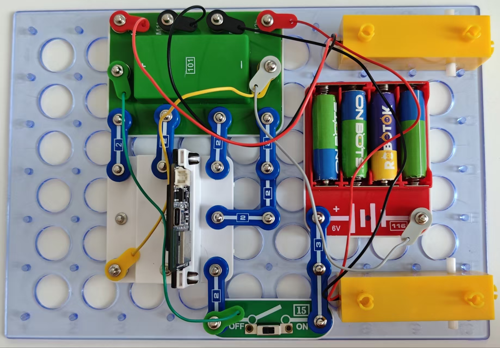

最简单的机器人

按照图示组装电路。本电路包括2个程序：
26_Robo-1 - “按正方形路线移动”
26_Robo-2 - “前后移动”

使用USB线将111号模块连接到电脑。然后上传程序。上传程序后，断开连接，把15号电源开关拨到ON位置。

运动参数取决于车轮的抓地力和电池电压。

26_ Robo-1
上传后，程序将按照以下算法控制机器人：前进2秒，向右转（在2秒内转90度），程序将无限循环执行上述动作。因此，机器人将按正方形路线移动。需要注意的是，运动参数取决于车轮的抓地力和电池电压。

26_ Robo-2
在本程序中，机器人沿直线移动，然后转身返回。回想一下，即使控制信号相同，但由于电机转速不同，机器人不会完全沿直线前进。尝试从程序片段中选择以下参数，确保机器人实际上沿直线移动，并旋转180度。

```c
#define left 180
#define right 175
#define turnTime 700
```

左电机转速
将此值从0变为255，调整直线前进时左电机的速度。

右电机转速
将此值从0变为255，调整直线前进时右电机的速度。

转向时间
按100增加或减少此值，完成180度转弯

您也可通过闪存驱动器访问这些程序。

