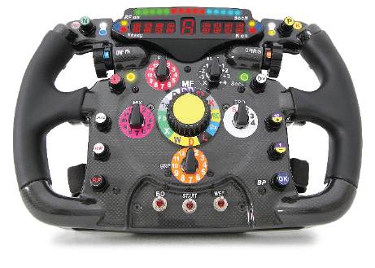

机器人指示灯

27_Robo-Lamp-2 - “加速度直线运动”。机器人开始以加速度直线运动，达到最高速度后逐渐减慢，然后180度转弯。你可通过LED的增减来观察机器人的速度变化。

使用USB线将111号模块连接到电脑。然后上传程序。上传程序后，断开连接，把15号电源开关拨到ON位置。

您也可通过闪存驱动器访问这些程序。

注意！

要让机器人一直朝一个方向运动，需要大约3米的自由空间。如空间不足，你可将机器人拿起，观察马达速度的变化，以及速度与LED灯两者之间的关联。

