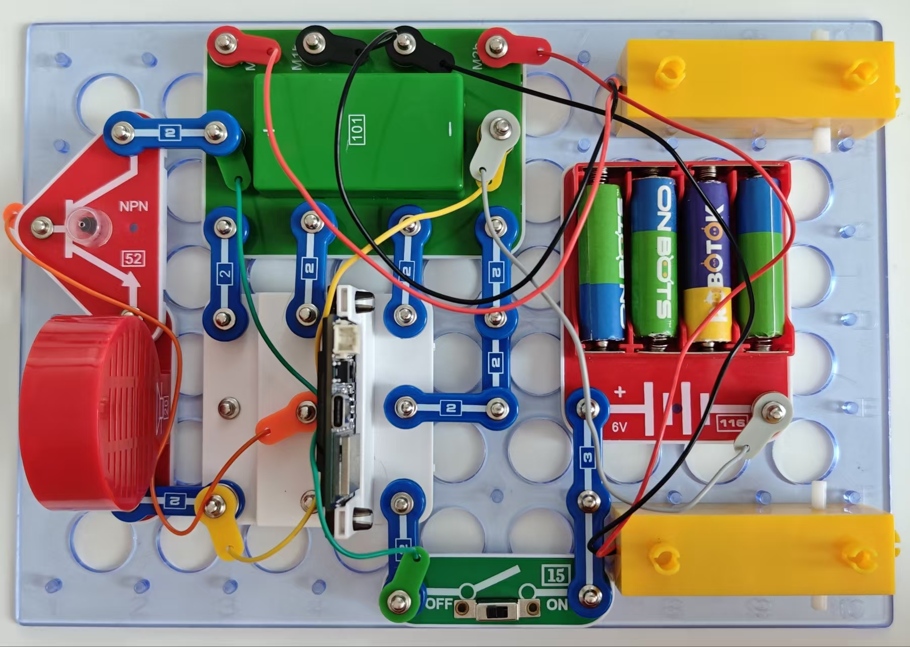

音乐机器人

按照图示组装电路。

使用USB线将111号模块连接到电脑，然后上传程序 28_Robo -Music-1。上传程序后，断开连接，把15号电源开关拨到ON位置。机器人将伴随着喇叭发出的声音开始直线移动。移动约1.5米后，机器人将转动180度，发出适当的声音，然后沿直线移动约1.5米（理想情况下，它应该回到起点），然后转180度。机器人只执行一次这个例程。要重新启动程序，你必须关掉机器人然后再打开。

您也可通过闪存驱动器访问这些程序。

