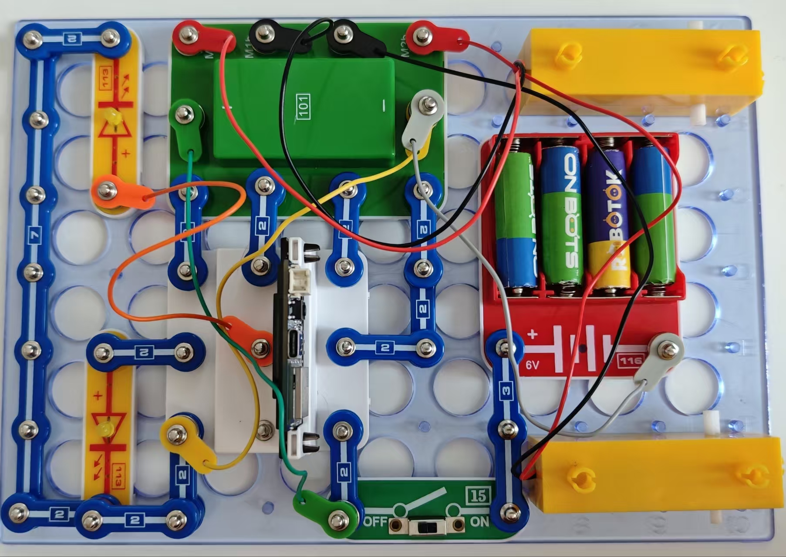

安全出行

道路安全取决于多种因素。我们将主要关注两个方面。按照图示组装电路。本电路包括1个程序：

30_Safety-1 - “转弯信号”。

使用USB线将111号模块连接到电脑并上传程序。上传程序后，断开导线，将“小车”放在地板上，将15号电源开关拨到ON的位置。机器人将开始直线移动，然后打开右转信号灯，右转，再开始移动，然后关闭转弯信号灯。机器人再次开始直线移动，然后打开左转信号灯，左转，再开始移动，然后关闭转弯信号灯，停止。停止时，两个信号将开始同步闪烁，模拟“紧急事故灯”信号。之后，它将转180度，并根据上面的算法开始移动。注意，我们很难让它真正地直线移动。

建议使用的自由空间为5米。如果空间不足，你可以拿着机器人完成这个实验。

