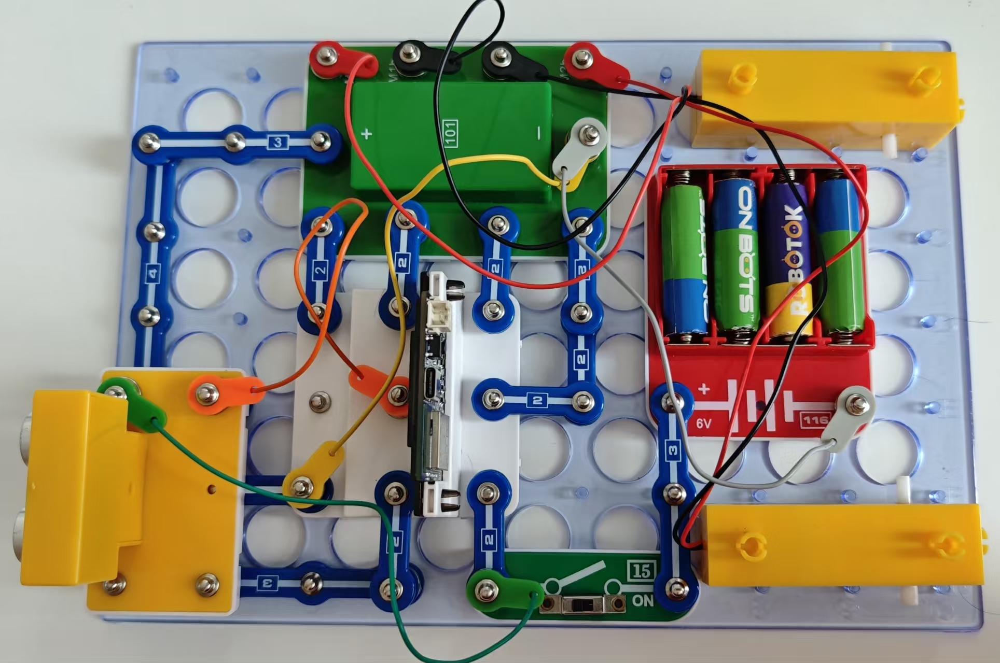

安全出行

按照图示组装电路。本电路包括2个程序：

30_Safety-2 - “避障行”。当小车移动到距离障碍物30厘米以内时，会停下并小转弯。如障碍物已不存在，小车将继续向前移动。如障碍物仍在“视线范围内”，小车将再小转弯。用书或家居在地板上搭建一个迷宫，观察小车能否顺利通过。

30_Safety-3 -“保持安全车距”。如果与前方物体的距离超过30厘米，汽车会继续向前行驶；如果等于30±1厘米，汽车会停下来；如果小于30厘米，它会后退并保持安全距离。

使用USB线将111号模块连接到电脑。然后上传程序。上传程序后，断开连接，把15号电源开关拨到ON位置。你可用手或本手册作为障碍物。

您也可通过闪存驱动器访问这些程序。

